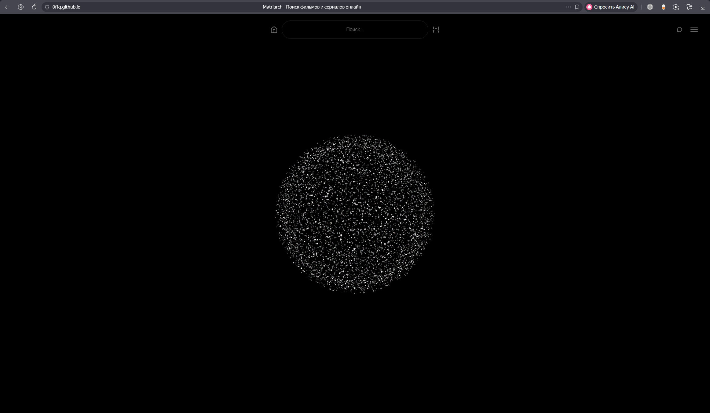
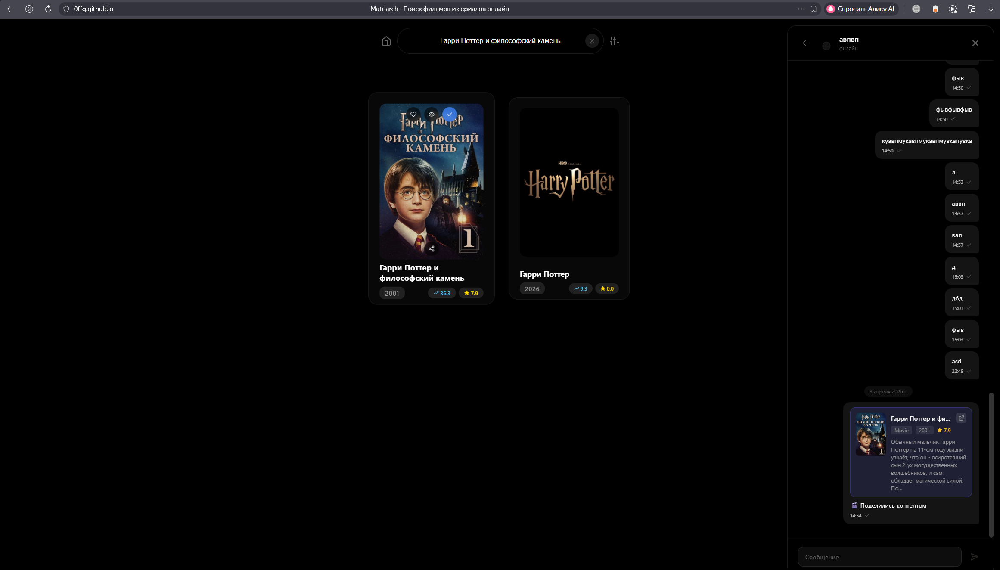
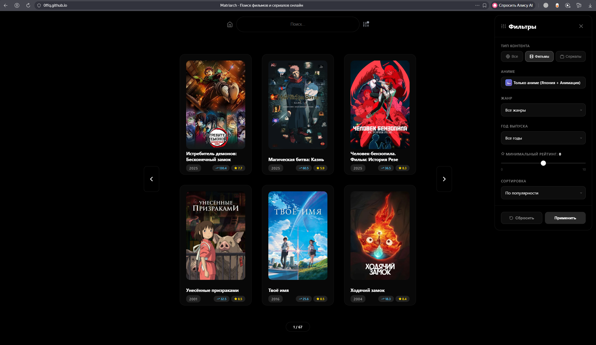
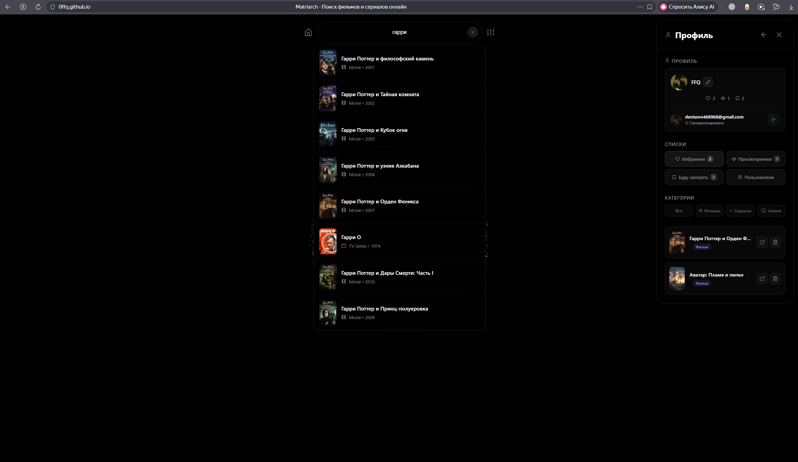
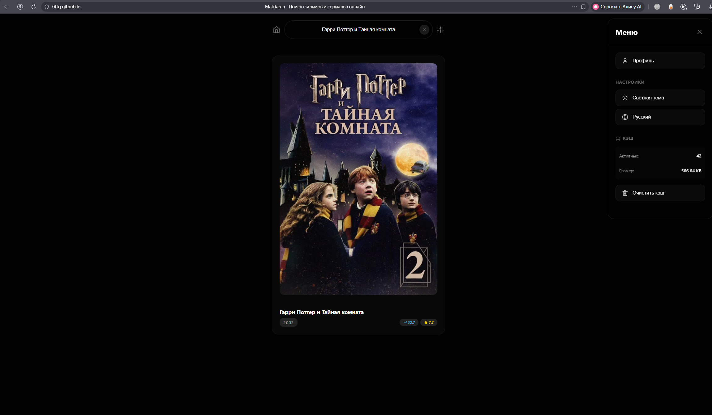

# Matriarch

Веб-приложение для поиска фильмов, сериалов и аниме через TMDB API.

**Демо:** https://0ffq.github.io/Matriarch/

## Скриншоты








## Что реализовано

**Поиск и фильтры**
- Поиск фильмов и сериалов с автоподсказками
- Фильтрация по типу (фильмы/сериалы/аниме), жанру, году, рейтингу
- Сортировка по популярности, рейтингу, дате, названию
- Пагинация результатов

**Пользователь**
- Авторизация через Google (Firebase)
- Профиль с именем и аватаром
- Списки: избранное, просмотренное, "буду смотреть"
- Синхронизация данных между устройствами через Firestore

**Мессенджер**
- Чат между пользователями в реальном времени
- Отправка и получение сообщений
- Индикатор набора сообщения
- Возможность поделиться фильмом/сериалом в чате
- Уведомления о новых сообщениях

**Интерфейс**
- Тёмная и светлая тема
- Русский и английский язык
- Клавиатурные сокращения
- Анимации через Framer Motion

**Производительность**
- Кэширование API-запросов в localStorage с TTL
- Debounce поисковых запросов
- Параллельные запросы через Promise.all
- Автоматическая очистка истёкшего кэша

## Стек

**Frontend:** React 18, Context API, Custom Hooks, Framer Motion, Axios
**Backend:** Firebase Auth, Firestore
**API:** TMDB (The Movie Database)
**Деплой:** GitHub Pages

## Архитектура

- Container/Presentational паттерн (AppContainer + компоненты)
- Custom Hooks для инкапсуляции бизнес-логики
- Context API для глобального состояния пользователя
- Модульная структура: компоненты, хуки, утилиты, сервисы Firebase
- Баррел-экспорты (index.js) для чистых импортов

## Запуск локально

```bash
npm install
npm start
```

Для работы нужен файл `.env` с API-ключами TMDB и Firebase (см. `.env.example`).

## Деплой

```bash
npm run deploy
```

## Автор

Разрабатывается в образовательных целях.
